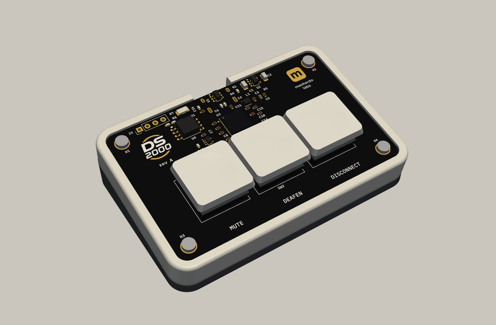
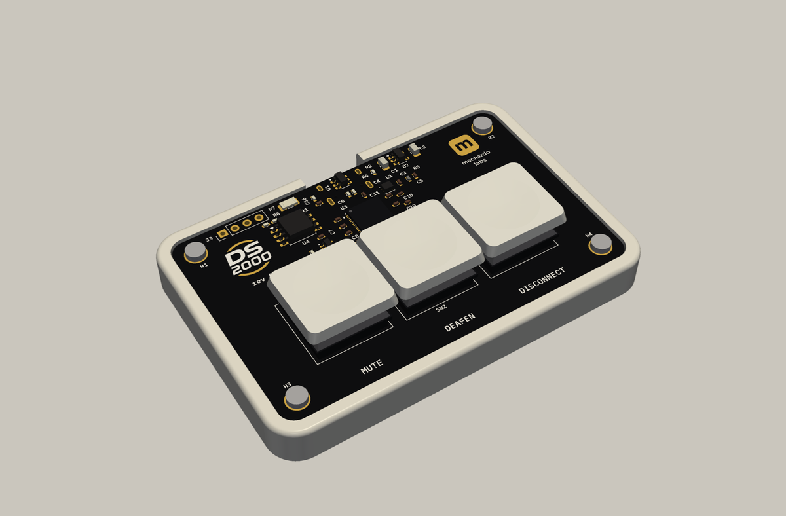
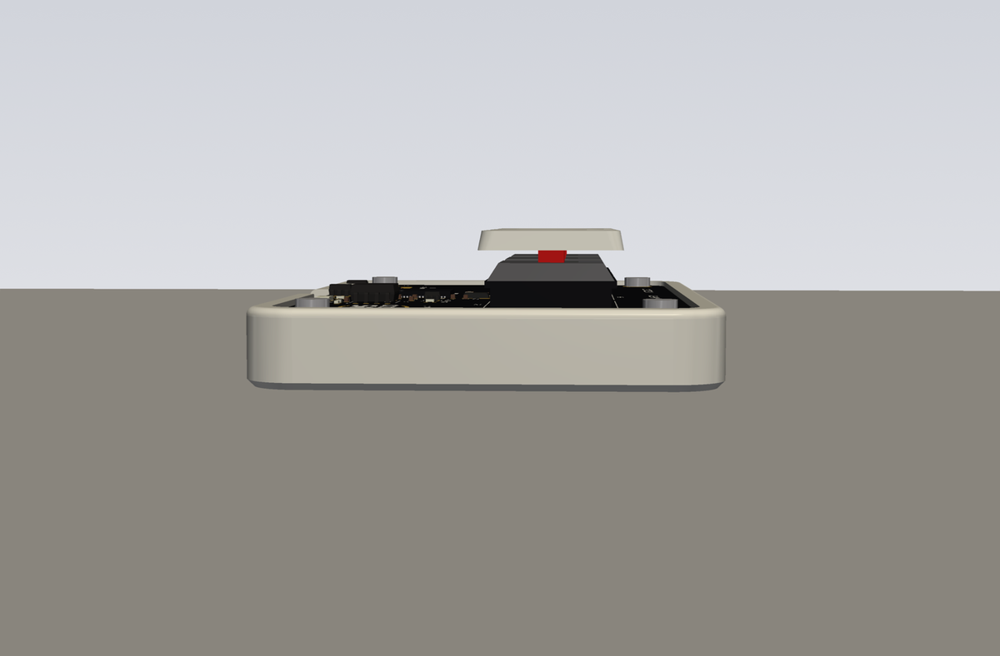
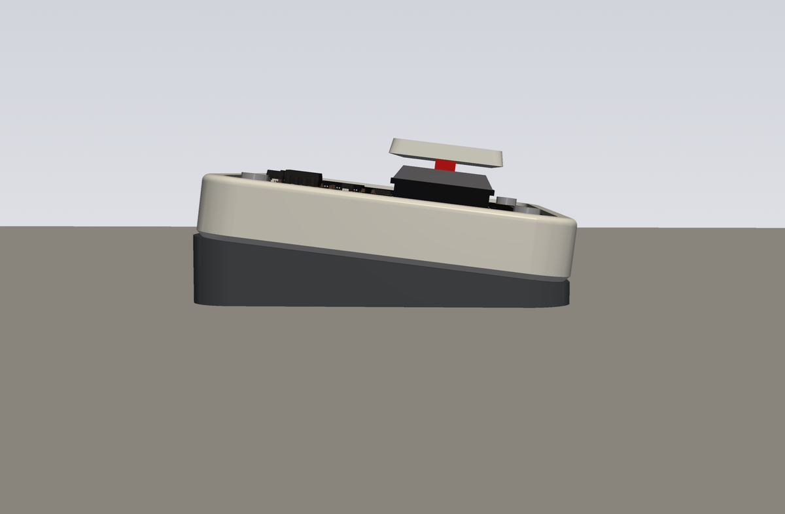
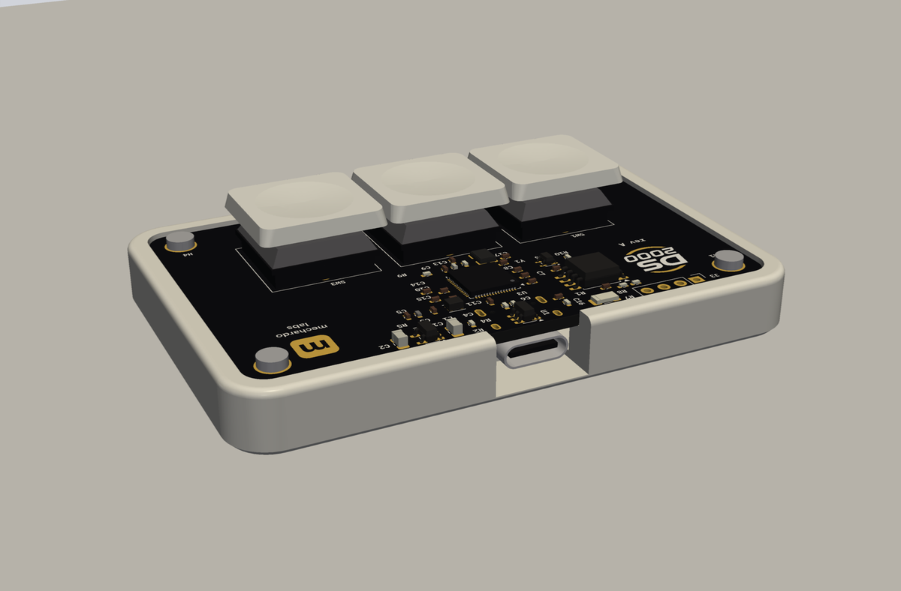
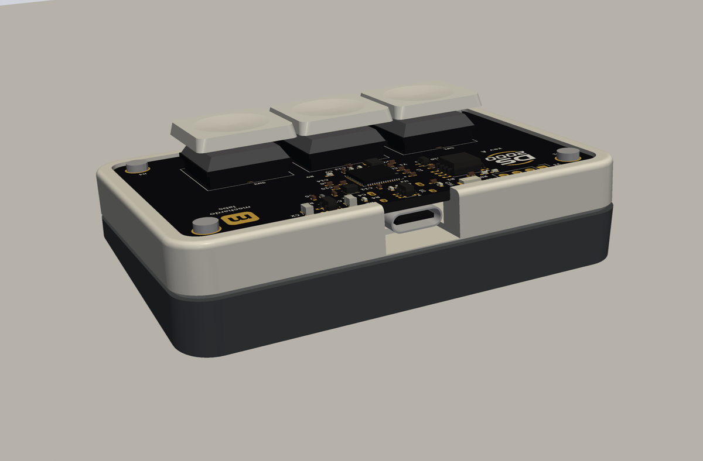
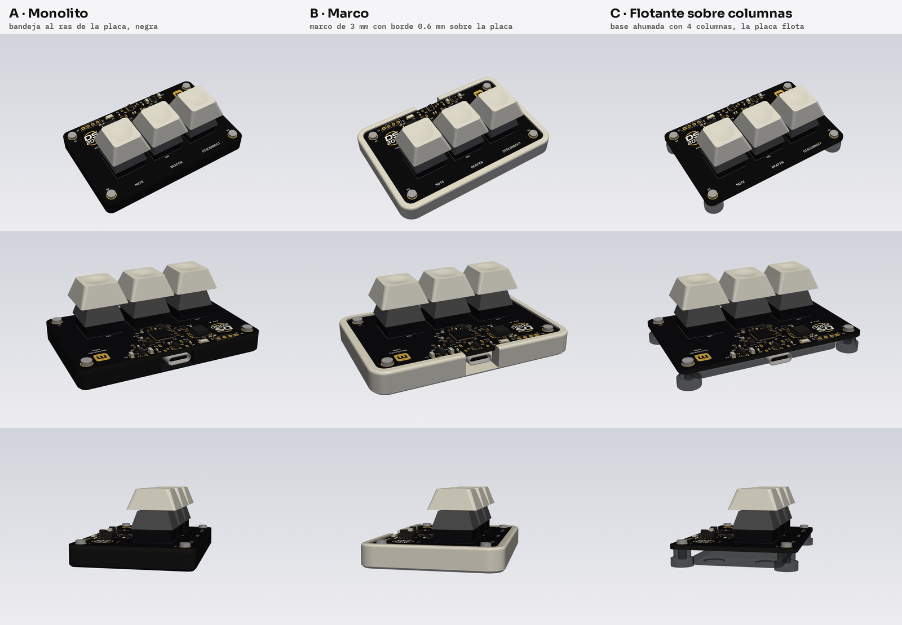

# DS-2000 Enclosure

3D-printed tray for the [DS-2000](https://github.com/Mechanix97/DS-2000), a three-key Discord control
deck. The PCB is the device's visible top face; the enclosure is the tray it sits in, screwed through
the board's four corner holes.

Modelled in **Fusion 360**. Fusion stores designs in the cloud, so this repository keeps exports
that anyone can use without a Fusion licence.

## Design: concept B, frame

The board sits recessed in a frame whose lip rises 0.6 mm above its top face, on four M2 bosses.
The keys are Kailh Choc V1 with flat MBK-style caps. **The same tray works in two ways**: flat on
rubber feet, or on a separate 7° wedge held by four 6 × 1.5 mm magnets. The USB-C stays at the back in
both. Details in [`docs/requirements.md`](docs/requirements.md).

| Flat | On the 7° wedge |
|---|---|
|  |  |
|  |  |
|  |  |

These are the concept renders from [`tools/concepts/`](tools/concepts/), made to pick a direction.
The final model is built in Fusion 360.

The three concepts considered (#1)

A, a monolith that follows the board outline; **B, a frame (chosen)**; C, the board floating on
columns over a smaller base.

## Layout

| Folder | Contents |
|---|---|
| `cad/` | Fusion 360 archives (`.f3d` / `.f3z`) of the enclosure |
| `step/` | STEP of the enclosure (and of the full assembly) |
| `print/` | Printable parts (`.stl` / `.3mf`) with orientation and settings |
| `pcb/` | The board as a solid model and its mechanical reference, pinned to a PCB revision |
| `docs/` | Requirements, renders (`docs/img/`), assembly guide, BOM |
| `tools/` | Concept scripts (build123d + pyvista) |

CAD and print files live in Git LFS (`.gitattributes`); run `git lfs install` once before cloning.

## Related repositories

- [DS-2000](https://github.com/Mechanix97/DS-2000): desktop application
- [DS-2000-Firmware](https://github.com/Mechanix97/DS-2000-Firmware): firmware
- [DS2000-PCB](https://github.com/Mechanix97/DS2000-PCB): board (KiCad)

## License

AGPL-3.0, see [`LICENSE`](LICENSE), like the rest of the DS-2000 project.
